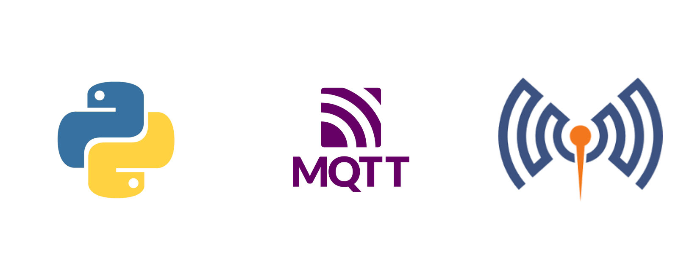

<div align="center" id="top"> 
  

  &#xa0;

</div>

<h1 align="center">MQTT Chat Application</h1>

<p align="center">
  

  

  
</p>

<p align="center">
  <a href="#dart-sobre">Sobre</a> &#xa0; | &#xa0; 
  <a href="#rocket-tecnologias">Tecnologias</a> &#xa0; | &#xa0;
  <a href="#white_check_mark-como-usar">Como Usar</a> &#xa0; | &#xa0;
  <a href="#gear-comandos-para-instala%C3%A7%C3%A3o-e-execu%C3%A7%C3%A3o">Comandos para Instalação e Execução</a> &#xa0; | &#xa0;
  <a href="#books-padr%C3%B5es-de-commits">Padrões de Commits</a> &#xa0; | &#xa0;
  <a href="https://github.com/Pedrinhonitz" target="_blank">Autor</a>
</p>

<br>

## :dart: Sobre ##

Este projeto é uma aplicação de chat simples usando MQTT (Message Queuing Telemetry Transport) como protocolo de comunicação. Ele demonstra como criar uma configuração básica de chat com um servidor e clientes que se comunicam através de um broker MQTT (Mosquitto).

## :rocket: Tecnologias ##

As seguintes ferramentas foram utilizadas neste projeto:

- [Python](https://www.python.org/)
- [MQTT](https://mqtt.org/)
- [Mosquitto](https://mosquitto.org/)
- [Docker](https://www.docker.com/)
- [Docker Compose](https://docs.docker.com/compose/)

## :white_check_mark: Como Usar ##
```bash
# Clone
$ git clone https://github.com/Pedrinhonitz/mqtt-chat-application.git

# Entrando na Pasta
$ cd mqtt-chat-application

# Abrindo no VScode
$ code .

# Instalando Docker. (caso ainda não tenha)
$ make docker-install

# Fazendo Build do Projeto
$ make build

# Abrir o Servidor via Terminal
$ make start-server

# Abrir o Client via Terminal. (Pode abrir quantos quiser, cada client simula 1 pessoa e 1 termina novo)
$ make start-client

# Encerrando a Execução do Projeto
$ make nuke
```

## :books: Padrões de Commits ##

<table>
  <thead>
    <tr>
      <th>Tipo de commit</th>
      <th>Emojis</th>
      <th>Palavra-chave</th>
    </tr>
  </thead>
 <tbody>
    <tr>
      <td>Correção</td>
      <td>🐛 <code>:bug:</code></td>
      <td><code>fix</code></td>
    </tr>
    <tr>
      <td>Documentação</td>
      <td>📚 <code>:books:</code></td>
      <td><code>docs</code></td>
    </tr>
    <tr>
      <td>Estrutura do Projeto</td>
      <td>🧱 <code>:bricks:</code></td>
      <td><code>ci</code></td>
    </tr>
    <tr>
      <td>Novo recurso</td>
      <td>✨ <code>:sparkles:</code></td>
      <td><code>feat</code></td>
    </tr>
    <tr>
      <td>Testes</td>
      <td>🧪 <code>:test_tube:</code></td>
      <td><code>test</code></td>
    </tr>
  </tbody>
</table>


#
Feito por <a href="https://github.com/Pedrinhonitz" target="_blank">Pedrinhonitz</a>

<a href="#top">Voltar ao topo</a>